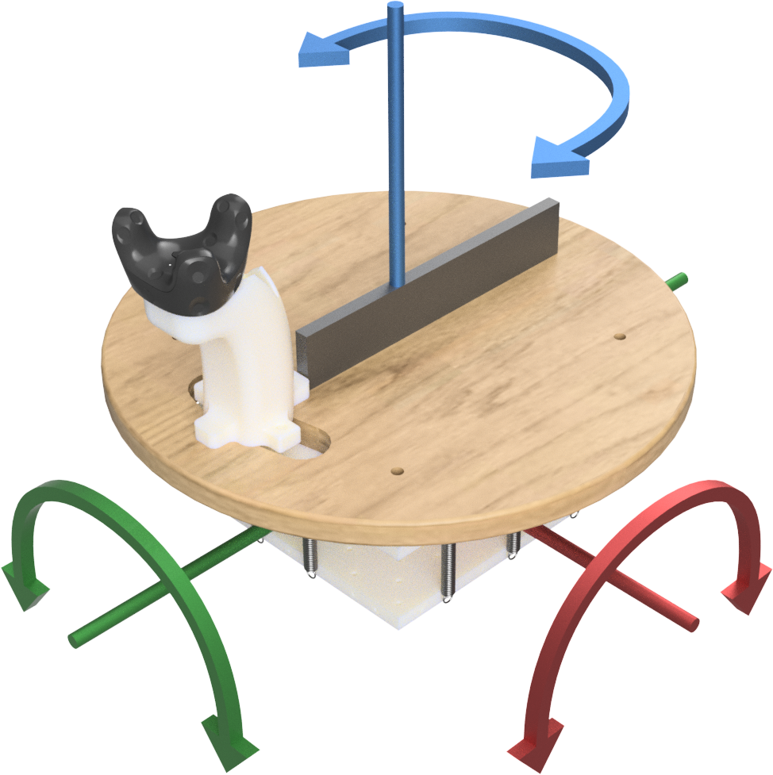

# Self-centering 3-DOF feet controller for hands-free locomotion control in telepresence and virtual reality

This repository hosts the model files for a mostly 3D printed hands-free locomotion controller.

To assemble you require:

* 50x70x14 mm thrust bearing (1) 
* Tension springs 6.3x22.5 mm (diameter, length) (multiple, we used 10)
* Tension springs 5.5x20.2 mm (diameter, length) (4)
* rounded furniture roller plate (should be replaceble by custom wooden or aluminum plate)
* Multiple M4 hooks to fix the springs
* M8 (maybe M6) bolt and nut to fix the rotational axis
     
The ball joint top and bottom snap fit into each other (use a little lubricant).
The thrust bearing fits in the rotational joint. This joint should be fixed by a bolt and a nut to counter. 
Tension springs can be installed depeding on your requirements.

The files can also be found on [Printables](https://www.printables.com/model/961854)
